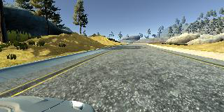

# Behavioral Cloning
*Author:* **Pawel Piela**
*Date:* **16/4/2018**

## Project

The goal of this project is to teach an autonomous car to make decisions how to turn the steering wheel based on the input from the camera based on top of the bonnet. It uses Covnet and behavioral cloning technique to achieve this goal.

## Model

I am using NVIDIA's covnet model because it is proved to work in the real life in much more complicated environments. It is also easy to implement.

|Name|Input Size|Kernel Size|Kernel Depth|Stride|Activation|
|-|-|-|-|-|-|
|Normalized Input| 66x200x3|||||
|Conv1| 66x200x3| 5x5| 24| 2x2|ReLU|
|Conv2| 31x98x24| 5x5| 36| 2x2|ReLU|
|Conv3| 14x47x36| 5x5| 48| 2x2|ReLU|
|Conv4| 5x22x48| 3x3| 64| 1x1|ReLU|
|Conv5| 3x20x64| 3x3| 64| 1x1|ReLU|
|Flatten| 1x18x64||||
|FC1| 1152||||ReLU|
|FC2| 1164||||ReLU|
|FC3| 100||||ReLU|
|FC4| 50||||ReLU|
|FC5| 10||||ReLU|
|Output|1|||||

## Training

The model is trained on 44,344 images from the car simulator provided by Udacity. The full set of images is divided into three groups from one of each of car's cameras (Left, Center and Right). I use all of those images to train the model, although the final model make decisions based on the image from the center camera only. Images from left and right cameras are used to augment the data. Perspective correction has to be applied to the steering wheel angle if we want to use the other images. Correction of 2.5 degree is emprically proved to work well with the simulator. Training data consists of images from 6 full laps in the center of the lane and 2 reverse laps and 1.5 laps of recovering from the side of the road. Images are normalized around 0 with values between -0.5 to 0.5. They are cropped at the top and the bottom to erase tree lines/bonnet from the training images. Then they are resized from original size (320x160x3) to 200x66x3 to be in line with the model architechure used in this project.

I use the following hyperparameters to train the model.

|Name|Value|
|-|-|
|Epochs|5|
|Batch Size|64|
|Optimizer|Adam|
|Learning Rate|0.001|

Every epochs takes abour 74 seconds to complete on AWS g2.2xlarge instance. Accuracy loss flattens after the 3rd epoch and repeating the training more that 5 times does not bring any significant improvement. Batch size is chosen arbitrarily.

## Result

The car learns to copy trainers behaviour and succesfully drives along the track in a safe way. [Video](https://youtu.be/oVbxr-pBszo)
